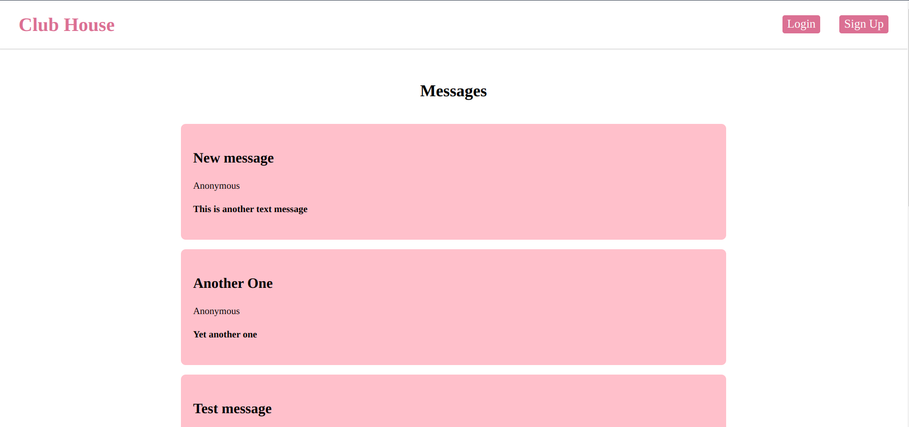
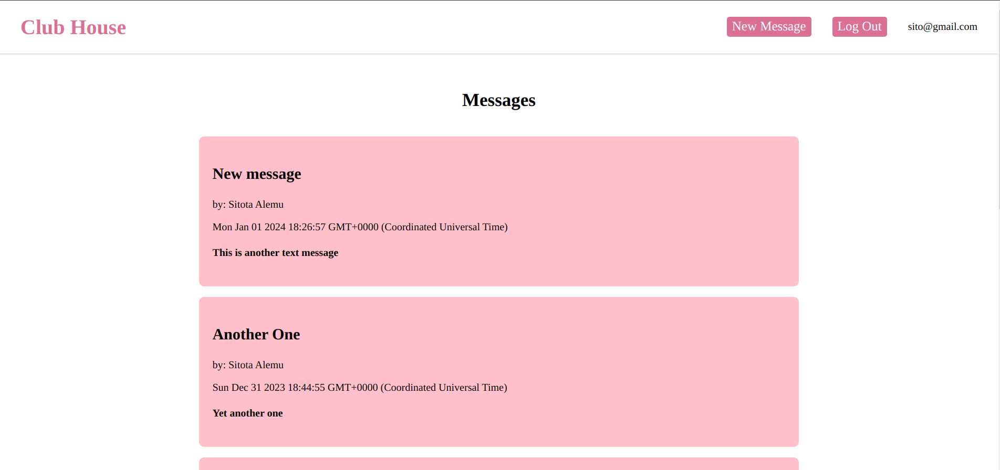

# Club House

A private messaging application with user authentication and authorization functionality.

## Description

Club Housean app that enables registered users to create anonymous posts visible to all site visitors. While inside the clubhouse, members can see the author's identity, but outside, only the message is visible. Admin users have additional permissions to delete posts.

## Live Preview

You can find the app [here](https://club-house.adaptable.app/)

## Tech Stack

- Node.js
- Express.js
- MongoDB / Mongoose
- Passport.js
- Bcrypt
- Pug (view engine)

## Features

1. **Database Models:**
   - User Model: Contains user information such as name, email (used as a username), password, and membership status.
   - Message Model: Represents the posts created by users, including a title, timestamp, and text. The model also keeps track of the author of each message.

2. **Project Structure:**
   - Generated with Node.js and organized according to the models.
   - User authentication implemented using Passport.js.
   - User inputs sanitized, validated, and secured with bcrypt during sign-up.

3. **Project Flow:**
   - Sign-Up Form: Users can register using a form with sanitized and validated fields.
   - Membership Status: Users must enter a secret passcode to obtain membership status.
   - Login Form: Users can log in using Passport.js, revealing additional features.
   - Create a New Message: Logged-in users can create new messages.
   - Display Messages: All member messages displayed on the home page. Author and date visible only to club members.
   - Admin Privileges: Users with admin status can delete messages.

## Getting Started

To run the application locally:

1. Clone the repository.
2. Install dependencies using `npm install`.
3. Set up a MongoDB database and provide the connection URI in the .env file.
4. Run the application with `npm devstart`.
5. Access the application at `http://localhost:5000`.

## Contributing

Contributions are welcome! Feel free to open issues or pull requests.

## License

This project is licensed under the [MIT License](LICENSE).

## Acknowledgments

Special thanks to The Odin Project for providing an excellent curriculum that guided the development of this Club House application.